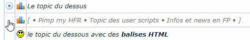

[HFR] Drapeaux Persos
=====================

Permet de renommer le nom des sujets sur les pages favoris et drapeaux.

## Fonctionnalités
- Renommage des sujets en cliquant sur la première case de la ligne du sujet
- Possibilité d'utiliser des balises HTML et des émojis
- Import / Export de liste des sujets renommés

## Compatibilité

- Navigateurs : 
  - Firefox - non testé
  - Chrome v86.0.4240.111
- Extensions :
  - Greasemonkey - non testé
  - Tampermonkey - non testé
  - Violentmonkey v2.12.7

## Historique

Voir l'[historique](CHANGELOG.md).

## Licence

Ce script est sous license [AGPL](LICENSE).
